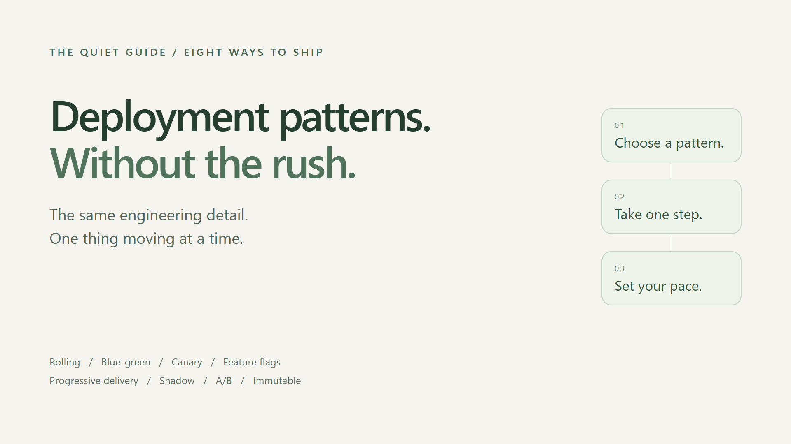
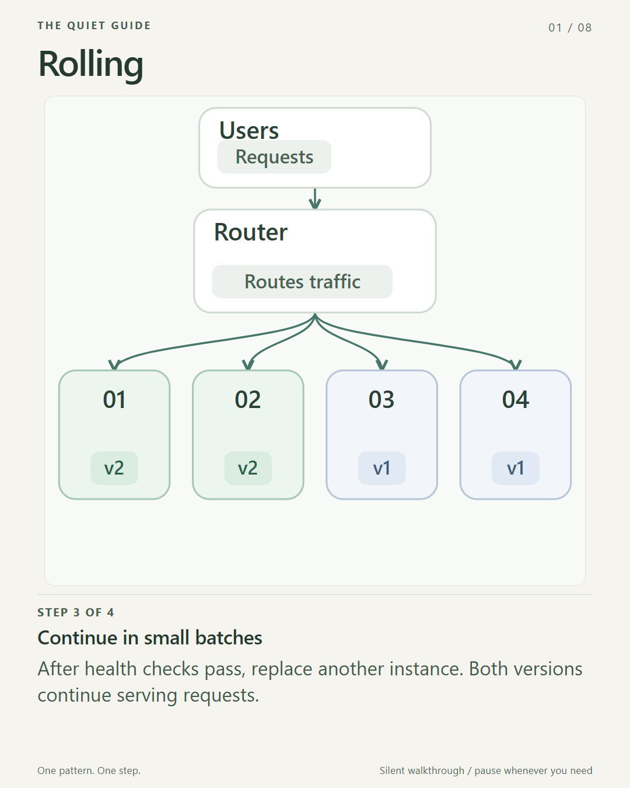
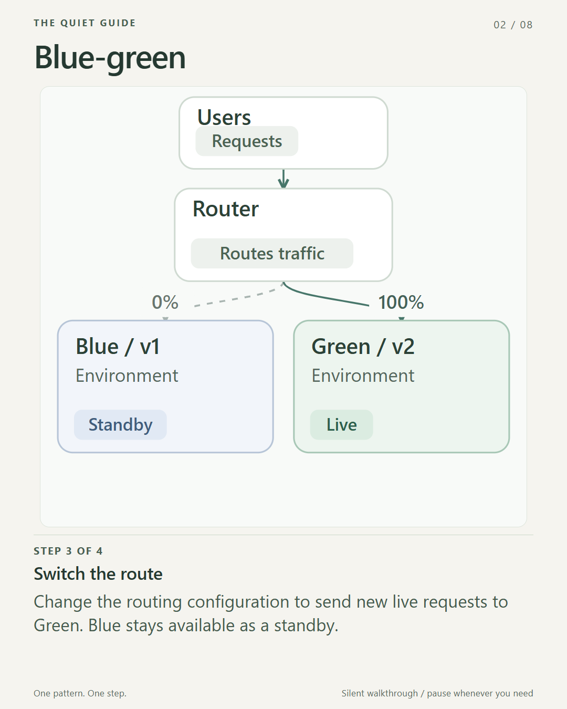
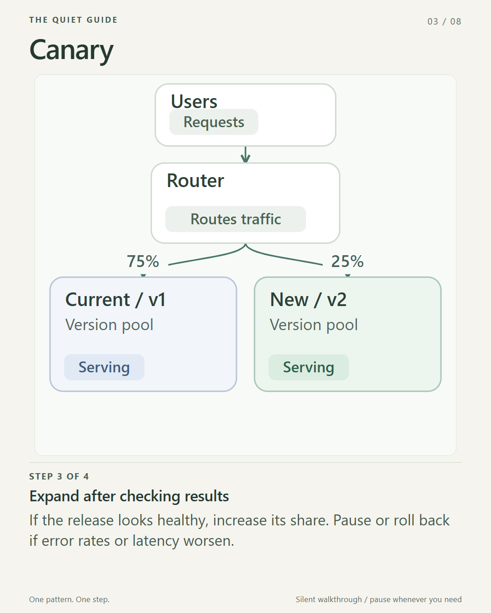
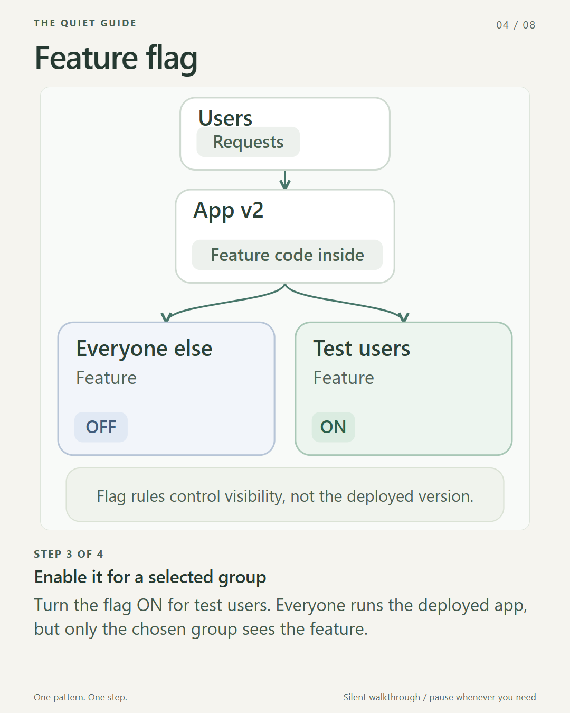
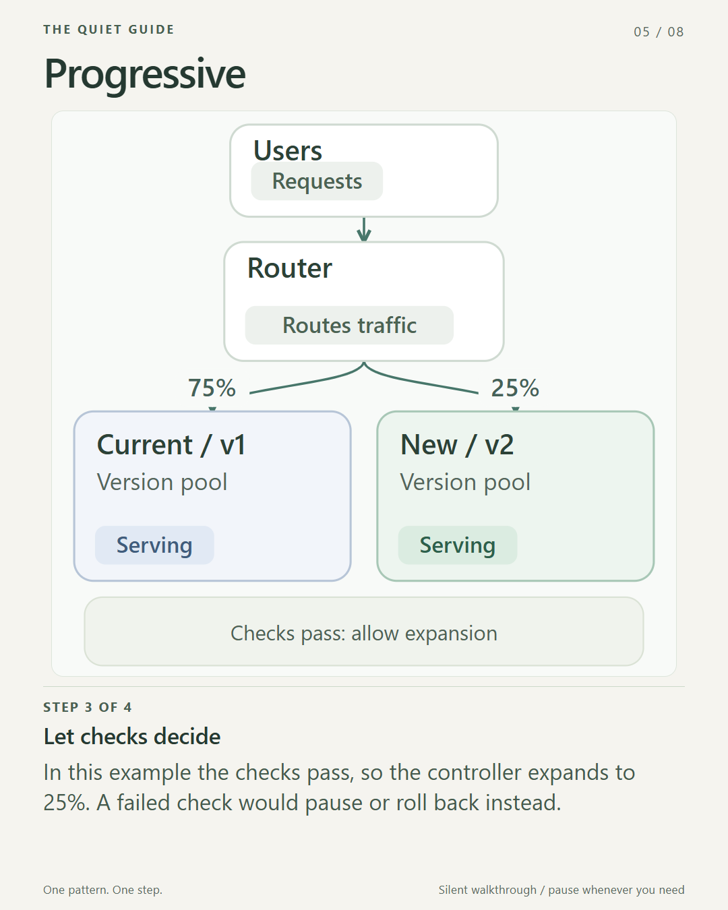
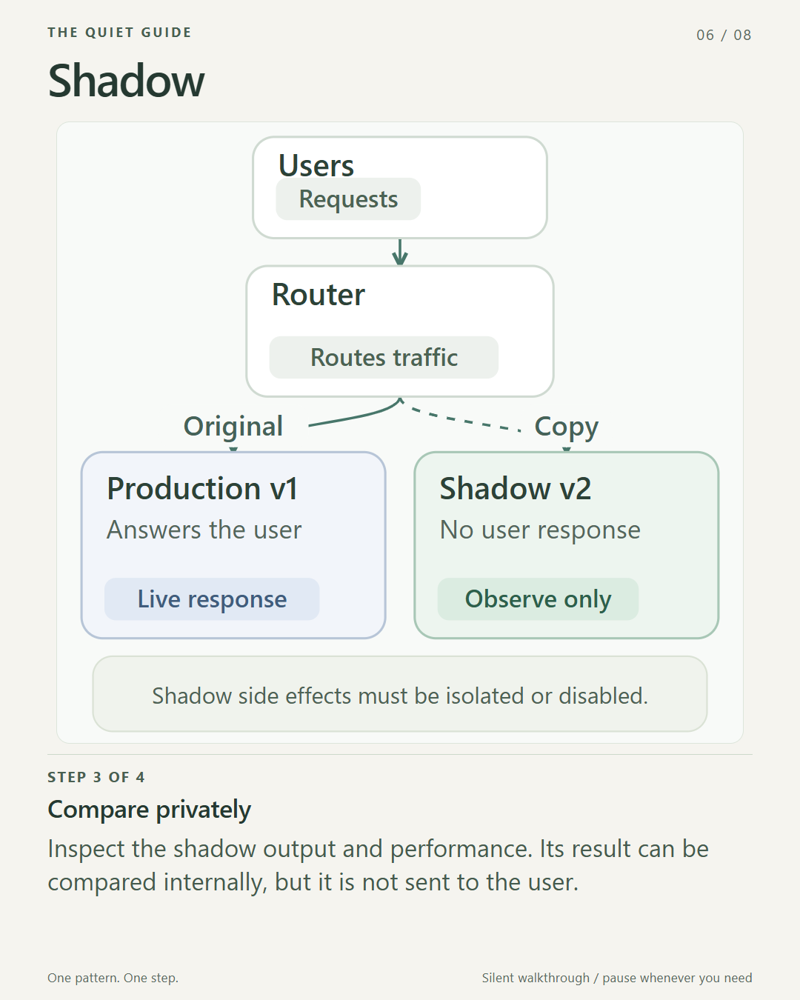
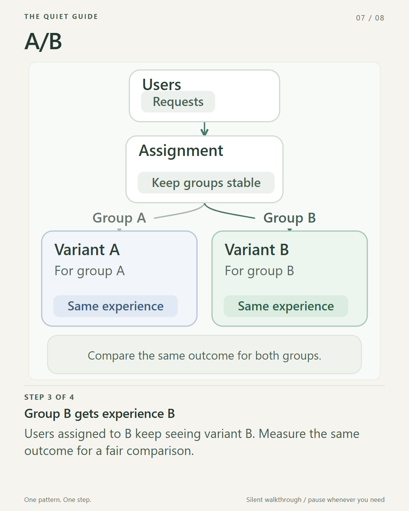
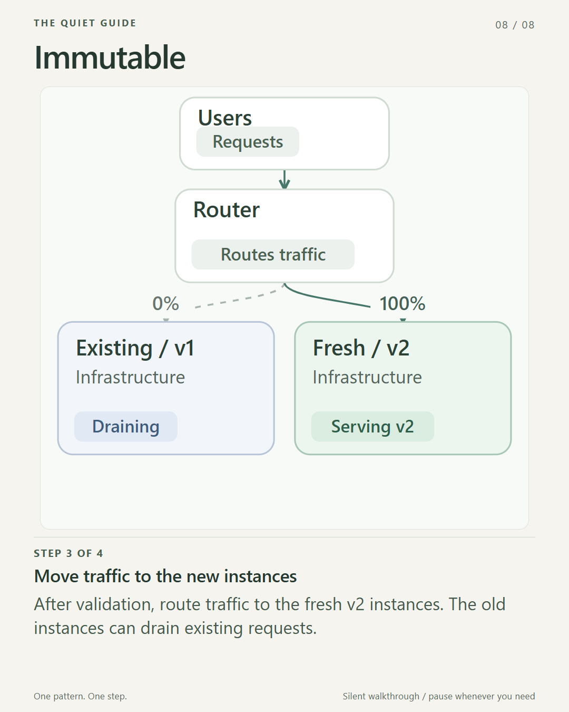

# Eight deployment patterns, without the visual overload

A deployment diagram should make a system easier to understand.

When eight diagrams are moving at once, it can do the opposite. The challenge becomes deciding where to look, rather than understanding what changed.

I wanted a quieter way to explain deployment patterns: keep the engineering detail, lose the competing motion.

This guide pairs short explanations with still diagrams, an optional interactive companion, and slow video walkthroughs. Nothing important is available only through animation.

[Open the interactive guide](interactive.html). It starts paused, with motion off on the first visit. Choose one pattern, move through the steps manually, or opt into slow playback. There are no automatic loops or jumps to the next pattern.

## First, these are not eight mutually exclusive choices

Some patterns describe **how instances are replaced**. Others describe **how traffic moves**, **when a feature becomes available**, or **how we learn from a release**.

You can combine them. For example, fresh immutable instances can be introduced through a canary rollout, while a feature flag keeps one capability hidden.

The useful question is not "Which pattern is best?"

It is: **"Which risk or decision am I trying to control?"**

## 1. Rolling: replace a few instances at a time

Start with several healthy instances running v1. Replace one with a healthy v2 instance, check the result, and continue in small batches.

For part of the rollout, both versions serve traffic. The whole fleet does not switch in one step.

**Useful when:** you want a gradual update without maintaining two complete environments.

**Watch for:** compatibility between versions, readiness checks, and enough healthy capacity. A rolling strategy is not, by itself, a guarantee of zero downtime.

**Keep this distinction:** instances change gradually; old and new versions coexist.

[Explore Rolling interactively](interactive.html?pattern=rolling) | [Watch the slow Rolling video](videos/01-rolling.mp4) | [Read the video transcript](transcripts/01-rolling.txt)

## 2. Blue-green: switch the live environment

Blue serves the current version. Green is a separate environment where you deploy and validate the new version without sending it live traffic.

When Green is ready, change the traffic destination. Keep Blue available for a rollback window if your system allows it.

**Useful when:** you want a clear cutover and a prepared previous environment.

**Watch for:** duplicate capacity and shared state. Switching the router back does not undo database writes, schema changes, or external side effects.

**Keep this distinction:** you switch environments, rather than updating every running instance in place.

[Explore Blue-green interactively](interactive.html?pattern=blue-green) | [Watch the slow Blue-green video](videos/02-blue-green.mp4) | [Read the video transcript](transcripts/02-blue-green.txt)

## 3. Canary: limit the first exposure

Give the new version a small share of traffic while most requests stay on the proven version.

For example, start at 5%, compare errors and latency with the baseline, and expand only when the results justify it. The percentages in this guide are illustrations, not a universal rollout recipe.

**Useful when:** you want production feedback without exposing everyone immediately.

**Watch for:** an unrepresentative sample or metrics that hide problems for a particular user group.

**Keep this distinction:** a canary primarily asks, "Is this release safe enough to expand?"

[Explore Canary interactively](interactive.html?pattern=canary) | [Watch the slow Canary video](videos/03-canary.mp4) | [Read the video transcript](transcripts/03-canary.txt)

## 4. Feature flags: separate deployment from release

Deploy the code with the feature switched off. Enable it for a selected group, and make it available more widely when you are ready.

The application can contain the new code without exposing the new experience to everyone.

**Useful when:** release timing should be independent of deployment timing.

**Watch for:** forgotten flags and untested combinations. A feature flag is not an authorization boundary, and turning one off does not necessarily undo work already performed.

**Keep this distinction:** code being present and a feature being available are different states.

[Explore Feature flags interactively](interactive.html?pattern=feature-flag) | [Watch the slow Feature flag video](videos/04-feature-flag.mp4) | [Read the video transcript](transcripts/04-feature-flag.txt)

## 5. Progressive delivery: make expansion conditional

Progressive delivery coordinates stages of increasing exposure with checks that decide whether to continue.

It can use canary traffic shifts, feature flags, and automated analysis. A healthy result allows the next stage; a regression can trigger a pause or rollback.

**Useful when:** you want a repeatable release process with explicit safety gates.

**Watch for:** weak thresholds or an untested rollback path. Automating a decision does not make its underlying signal reliable.

**Keep this distinction:** this is an approach to managing a release, not one more mutually exclusive routing shape.

[Explore Progressive delivery interactively](interactive.html?pattern=progressive) | [Watch the slow Progressive video](videos/05-progressive.mp4) | [Read the video transcript](transcripts/05-progressive.txt)

## 6. Shadow: observe the new version without letting it answer users

Keep the real request on the production path and send a copy to the shadow version.

You can inspect its output and performance, but the user still receives the production version's response. This is duplication for observation, not a split of live responses between versions.

**Useful when:** you want realistic workload feedback before the new implementation serves users.

**Watch for:** side effects. A mirrored request must not accidentally charge a customer, send another email, or change live data. Isolate or disable those effects.

**Keep this distinction:** the shadow version observes the workload; it does not provide the user response.

[Explore Shadow interactively](interactive.html?pattern=shadow) | [Watch the slow Shadow video](videos/06-shadow.mp4) | [Read the video transcript](transcripts/06-shadow.txt)

## 7. A/B: compare outcomes for stable groups

Assign users to different experiences and measure a defined outcome, such as task completion.

Keep the assignment stable so that a person does not randomly switch experiences on every request. Compare the same outcome across groups with an appropriate analysis.

**Useful when:** you want evidence about which experience works better for a particular goal.

**Watch for:** inconsistent assignments, too little data, or declaring a winner before the experiment supports it.

**Keep this distinction:** A/B testing asks about user outcomes. Canary releases ask primarily about release safety. Their mechanisms can overlap, but their objectives differ.

[Explore A/B interactively](interactive.html?pattern=ab) | [Watch the slow A/B video](videos/07-ab.mp4) | [Read the video transcript](transcripts/07-ab.txt)

## 8. Immutable: replace infrastructure instead of patching it

Build fresh instances from a known image or configuration. Validate them, move traffic, and retire the old instances when they are no longer needed.

The existing v1 instances do not get modified into v2.

**Useful when:** you want repeatable deployments and less configuration drift.

**Watch for:** persistent data that has been left on disposable instances. Keep that data outside the replacement boundary.

**Keep this distinction:** immutable describes how infrastructure changes. You can still use rolling or blue-green traffic strategies around it.

[Explore Immutable interactively](interactive.html?pattern=immutable) | [Watch the slow Immutable video](videos/08-immutable.mp4) | [Read the video transcript](transcripts/08-immutable.txt)

## What makes the visuals more neurodivergent-friendly?

Not a special color palette, and not simply slowing everything down.

The main change is **giving the reader control**:

- One pattern is explained at a time.
- The interactive guide opens paused; moving markers are optional.
- Back, Next, and Pause keep the reader in charge of the pace.
- Nothing loops automatically or advances to another pattern.
- The interactive guide respects the system's reduced-motion preference.
- Still diagrams and text explain the same concepts without requiring motion.

The optional videos hold each step for 15 seconds. They have no sound, rapid cuts, or looping sequence. Each has a transcript and caption file. Video-host autoplay settings are separate from the animation itself; the no-motion route remains available.

"Neurodivergent-friendly" is a design intention, not a promise that one presentation will suit every neurodivergent person. Attention and sensory preferences vary.

The goal is not less technical depth. It is less competition for attention.

## The practical takeaway

Choose the mechanism that matches the decision: replace instances, switch traffic, control feature visibility, observe behavior, or compare outcomes.

Then make the explanation just as intentional as the release.

**Readers should not have to race the diagram to understand the system.**

### Further reading

- [Argo Rollouts: deployment strategies and progressive delivery](https://argo-rollouts.readthedocs.io/en/stable/concepts/)
- [Martin Fowler: Blue-green deployment](https://martinfowler.com/bliki/BlueGreenDeployment.html)
- [Pete Hodgson: Feature toggles](https://martinfowler.com/articles/feature-toggles.html)
- [Martin Fowler: Immutable server](https://martinfowler.com/bliki/ImmutableServer.html)
- [W3C: Understanding animation from interactions](https://www.w3.org/WAI/WCAG22/Understanding/animation-from-interactions.html)
